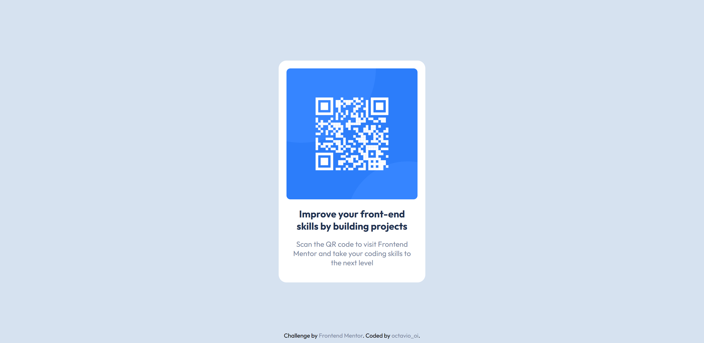

# Frontend Mentor - QR code component solution

That is my solution to the [QR code component challenge on Frontend Mentor](https://www.frontendmentor.io/challenges/qr-code-component-iux_sIO_H).

## Table of contents

- [Overview](#overview)
  - [Screenshots](#screenshots)
  - [Links](#links)
- [My process](#my-process)
  - [Built with](#built-with)
  - [Useful resources](#useful-resources)
- [Author](#author)

## Overview

### Screenshots

### Links

- Challenge URL: [QR code component challenge](https://www.frontendmentor.io/challenges/qr-code-component-iux_sIO_H)
- Solution URL: [QR code component solution](https://octavio-oi.github.io/Frontend-Mentor-Challenges-Complete/challenges/qr-code-component/)

## My process

### Built with

- Vanilla HTML5.
- Vanilla CSS3.
- Desktop-first.

### Useful resources

- [Cloudconvert](https://cloudconvert.com/) - to convert fonts in ttf format to woff and woff2.
- [TinyPNG](https://tinypng.com/) - to compress all the images.
- [Live Server](https://marketplace.visualstudio.com/items?itemName=ritwickdey.LiveServer) - to hosts the site locally for testing.

## Author

- Frontend Mentor - [@octavio-oi](https://www.frontendmentor.io/profile/octavio-oi)
- Codepen - [@octavio-oi](https://codepen.io/octavio-oi)
- Twitter - [@octavio_oi](https://www.twitter.com/octavio-oi)
